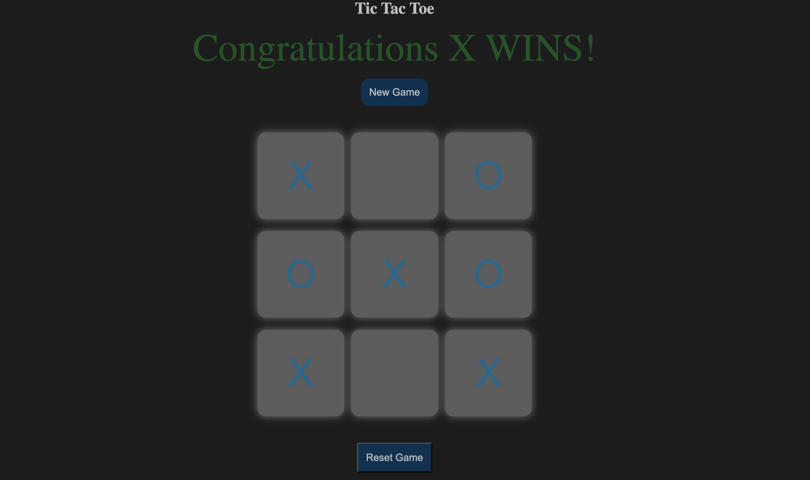

```markdown
# 🎮 Tic Tac Toe Game

A simple and interactive **Tic Tac Toe** game made using **HTML**, **CSS**, and **JavaScript**. This is a two-player game where players alternate between X and O. The first player to align three symbols (horizontally, vertically, or diagonally) wins!

---

## 🧠 Game Features

- ✅ Two-player game mode
- 🔁 Alternates turn between players
- 🏆 Detects winner and displays a congratulatory message
- 🤝 Detects tie when all boxes are filled with no winner
- ⛔ Disables boxes after being clicked
- 🔁 "Reset" button to clear the board during the game
- 🆕 "New Game" button to restart after win or tie

---

## 📁 Project Structure

```

tic-tac-toe/
├── index.html       # HTML structure
├── style.css        # CSS for styling the board and UI
└── script.js        # Game logic and interactivity

````

---

## 📸 Screenshot



---

## 🚀 How to Run

1. **Download** or **Clone** the repository:

   ```bash
   git clone https://github.com/your-username/tic-tac-toe.git
   ```
2. **Navigate** to the project directory and open `index.html` in your browser:

   ```bash
   cd tic-tac-toe
   open index.html
   ```

   Or just double-click `index.html` in your file explorer.

---

## 🧩 Game Logic Summary

* The board is made of a 3x3 grid of clickable boxes.
* On each click, a box is filled with either `"X"` or `"O"`.
* Winning patterns are checked after each turn.
* If a player wins, all boxes are disabled and a message is shown.
* If no one wins after 9 moves, a "Game Tie!!!" message is displayed.
* The board can be reset mid-game or a new game started after game over.

---

## 🔧 Technologies Used

* **HTML5** – Markup structure
* **CSS3** – Styling and layout
* **Vanilla JavaScript (ES6)** – Game mechanics and logic

---
```